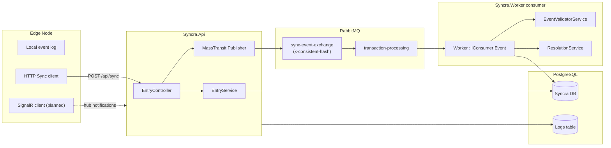

# Syncra

[](https://dotnet.microsoft.com/)
[](https://www.postgresql.org/)
[](https://www.rabbitmq.com/)

<!-- Optional: [](LICENSE) -->

**Syncra** is a distributed transaction synchronization backend designed for **intermittent connectivity**. Edge **nodes** batch financial events while offline, sync them to a central server, and (once complete) receive **real-time processing outcomes** so local state can converge with the server.

The system uses **event sourcing**, **account-level message partitioning**, **idempotent consumption**, **optimistic concurrency**, and **compensating transactions** when validation fails.

> **Status:** Core ingest → queue → worker pipeline is implemented. **ASP.NET Core SignalR** (node push notifications after processing) is the **last internal milestone** before a full **sync → process → notify** cycle is complete. Several read APIs are scaffolded but not fully implemented.

---

## Table of Contents

- [Overview](#overview)
- [Architecture](#architecture)
- [Features](#features)
- [Solution Structure](#solution-structure)
- [Prerequisites](#prerequisites)
- [Installation](#installation)
- [Configuration](#configuration)
- [Running the Application](#running-the-application)
- [API Reference](#api-reference)
- [Event Processing Pipeline](#event-processing-pipeline)
- [Data Model](#data-model)
- [Observability](#observability)
- [Roadmap](#roadmap)
- [Contributing](#contributing)
- [Support](#support)
- [License](#license)

---

## Overview

Syncra targets scenarios where clients (nodes) cannot rely on continuous connectivity to a central ledger:

1. **Nodes** record debits, credits, and related operations locally with monotonic `node_sequence` values.
2. When connectivity returns, nodes call **`POST /api/sync`** with a batch of pending events.
3. The API persists events as **`Pending`**, publishes them to **RabbitMQ** (consistent-hash routing by `accountId`), and returns acknowledgment.
4. A **MassTransit consumer** (`Syncra.Worker`) validates, replays history from snapshots, assigns **`server_sequence`**, updates projections, handles conflicts, and records **idempotency** outcomes.
5. **(Planned)** SignalR pushes per-event results to the originating node; **`GET /api/events`** remains the polling fallback when the hub is disconnected.

Swagger describes the API as: _"A distributed transaction system that supports intermittent connectivity."_

---

## Architecture



| Layer              | Project                 | Responsibility                                                         |
| ------------------ | ----------------------- | ---------------------------------------------------------------------- |
| **API**            | `Syncra.Api`            | HTTP endpoints, Swagger, Serilog, hosted cleanup job, MassTransit host |
| **Application**    | `Syncra.Application`    | DTOs, FluentValidation, repository interfaces                          |
| **Domain**         | `Syncra.Domain`         | Entities (`Event`, `Account`, `NodeState`, `Conflict`, …)              |
| **Infrastructure** | `Syncra.Infrastructure` | EF Core, repositories, RabbitMQ/MassTransit, migrations, seeding       |
| **Worker**         | `Syncra.Worker`         | Event consumption, validation, replay, compensation                    |

**Note:** Message processing is registered in `Syncra.Infrastructure` and runs **in-process with the API** today. `Syncra.Worker/Program.cs` is a minimal host stub; production deployment may later split the consumer into a dedicated worker process.

---

## Features

### Implemented

- **Batch sync ingest** — `POST /api/sync` accepts `SyncRequestDto` with `nodeId`, `events`, and `lastKnownServerSequence`.
- **Request validation** — FluentValidation (`SyncRequestDtoValidation`, `SyncEventRequestValidation`).
- **Durable event store** — Events persisted with `Pending` status before publish.
- **Message bus** — MassTransit + RabbitMQ; `x-consistent-hash` exchange; partitioner keyed by `aggregateId` (account).
- **Idempotent processing** — Duplicate `event_id` values are detected and skipped.
- **Event-sourced validation** — Snapshot + replay from last `AccountSnapshot`, then apply new event.
- **Server ordering** — Global `server_sequence` assignment on acceptance.
- **Account projections** — `AccountState` balance/version updates; snapshots every 100 versions.
- **Conflict handling** — Invalid events trigger compensating transactions and `Conflict` records (`ResolutionService`).
- **Retry / defer** — `FilterEventMsgRetryConfig` with exponential backoff and jitter (up to 20 attempts).
- **Concurrency** — EF optimistic concurrency (`Version` on entities); `DbUpdateConcurrencyExceptionHandler`.
- **Operational hygiene** — `DataCleanupService` purges idempotency keys older than 48 hours.
- **Dev seeding** — Bogus-based `DataSeeder` on first run (users, nodes, accounts, events, etc.).
- **API docs** — Swagger UI in Development (`/swagger`).

### In progress / planned

| Item                         | Description                                                                                                         |
| ---------------------------- | ------------------------------------------------------------------------------------------------------------------- |
| **SignalR hub**              | Push `accepted` / `rejected` / `compensated` outcomes to nodes after worker processing (closes sync → notify loop). |
| **Read APIs**                | `GET /api/accounts/{accountId}`, `GET /api/events?since=`, `GET /api/accounts/{accountId}/history` — stubs today.   |
| **Structured sync response** | `SyncResponseDto` exists; endpoint currently returns plain `"sent to exchange."`.                                   |
| **Dapper read path**         | Noted in `EntryController` for optimized reads.                                                                     |
| **AuthN / AuthZ**            | `UseAuthorization()` present; no scheme configured yet.                                                             |

---

## Solution Structure

```
Syncra/
├── Syncra.sln
├── Syncra.Api/                 # ASP.NET Core Web API (entry point)
├── Syncra.Application/       # DTOs, validation, interfaces
├── Syncra.Domain/              # Domain entities
├── Syncra.Infrastructure/      # EF Core, repos, MassTransit, migrations
└── Syncra.Worker/              # Consumer + validation/resolution services
```

---

## Prerequisites

| Requirement                                       | Version / notes                           |
| ------------------------------------------------- | ----------------------------------------- |
| [.NET SDK](https://dotnet.microsoft.com/download) | **10.0** (`net10.0` in projects)          |
| [PostgreSQL](https://www.postgresql.org/)         | **14+** recommended                       |
| [RabbitMQ](https://www.rabbitmq.com/)             | **3.x** with management plugin (optional) |
| **EF Core tools** (migrations)                    | `dotnet tool install --global dotnet-ef`  |

Optional:

- Docker / Docker Compose for PostgreSQL and RabbitMQ
- `psql` or a GUI (pgAdmin, DBeaver) for inspection

---

## Installation

### 1. Clone the repository

```bash
git clone https://github.com/<ORG_OR_USER>/Syncra.git
cd Syncra
```

### 2. Start dependencies

**PostgreSQL** (example):

```bash
docker run -d --name syncra-postgres \
  -e POSTGRES_USER=postgres \
  -e POSTGRES_PASSWORD=password \
  -e POSTGRES_DB=postgres \
  -p 5432:5432 \
  postgres:16
```

**RabbitMQ** (example):

```bash
docker run -d --name syncra-rabbitmq \
  -p 5672:5672 -p 15672:15672 \
  rabbitmq:3-management
```

### 3. Configure connection strings

Copy or edit `Syncra.Api/appsettings.Development.json` (or use User Secrets / environment variables):

```json
{
  "ConnectionStrings": {
    "localConnectionString": "Host=localhost;Port=5432;Database=postgres;Username=postgres;Password=password"
  },
  "RabbitMq": {
    "Host": "localhost",
    "Username": "guest",
    "Password": "guest"
  }
}
```

### 4. Apply database schema

The API calls `Database.EnsureCreatedAsync()` on startup. For migration-based workflows:

```bash
cd Syncra.Infrastructure
dotnet ef database update --startup-project ../Syncra.Api
```

Ensure a **`Logs`** table exists if using Serilog's PostgreSQL sink (`needAutoCreateTable: false` in `Program.cs`).

### 5. Build and run

```bash
dotnet restore
dotnet build Syncra.sln
dotnet run --project Syncra.Api
```

Development URLs (from `launchSettings.json`):

- HTTP: `http://localhost:5158`
- HTTPS: `https://localhost:7170`
- Swagger: `https://localhost:7170/swagger` (Development only)

---

## Configuration

| Key                                       | Location           | Description                   |
| ----------------------------------------- | ------------------ | ----------------------------- |
| `ConnectionStrings:localConnectionString` | `appsettings.json` | PostgreSQL connection         |
| `RabbitMq:Host`                           | `appsettings.json` | RabbitMQ hostname             |
| `RabbitMq:Username` / `Password`          | `appsettings.json` | Broker credentials            |
| `ASPNETCORE_ENVIRONMENT`                  | env                | `Development` enables Swagger |
| `Logging:LogLevel`                        | `appsettings.json` | Standard ASP.NET logging      |

**Production recommendations**

- Store secrets in environment variables, Azure Key Vault, or similar — never commit production passwords.
- Use `dotnet ef migrations` instead of `EnsureCreatedAsync` for controlled schema evolution.
- Enable TLS for PostgreSQL and RabbitMQ.
- Configure SignalR backplane (Redis/Azure SignalR) if scaling API instances horizontally _(after hub is implemented)_.

---

## Running the Application

```bash
dotnet run --project Syncra.Api --launch-profile https
```

On first run with an empty database, **seed data** is inserted (users, ~10k accounts, 20 nodes, sample events, etc.) via `DataSeeder`.

Verify:

1. Swagger loads at `/swagger`.
2. RabbitMQ management UI shows `sync-event-exchange` and `transaction-processing` after a sync.
3. Application logs show worker consumption and acceptance/rejection messages.

---

## API Reference

Base path: **`/api`**

### `POST /api/sync`

Submit a batch of events from a node.

**Request body** (`SyncRequestDto`):

```json
{
  "nodeId": "node-a",
  "lastKnownServerSequence": 1,
  "events": [
    {
      "event_id": "evt-001",
      "nodeSequence": 1,
      "nodeTimestamp": "2026-06-03T12:00:00Z",
      "eventType": 1,
      "accountId": "acc-1",
      "parentEventId": null,
      "payload": {
        "amount": 100.5,
        "reason": "POS purchase",
        "to_account_id": "acc-merchant-1"
      }
    }
  ]
}
```

**`eventType` enum** (`Event.EventType`):

| Value | Name                      |
| ----- | ------------------------- |
| 1     | `AccountDebited`          |
| 2     | `AccountCredited`         |
| 3     | `CompensatingTransaction` |
| 4     | `RejectedTransaction`     |

**Current response:** `200 OK` with body `"sent to exchange."`

**Planned response** (`SyncResponseDto`):

```json
{
  "status": "Pending",
  "messageId": "<correlation-id>",
  "receivedAt": "2026-06-03T12:00:01Z",
  "estimatedProcessingTime": "00:00:02",
  "message": "Events queued for processing. Listen for SignalR notifications."
}
```

**cURL example:**

```bash
curl -X POST "https://localhost:7170/api/sync" \
  -H "Content-Type: application/json" \
  -d @sync-payload.json \
  -k
```

### `GET /api/accounts/{accountId}` _(stub)_

Returns current account projection (`AccountStateResponseDto` planned).

### `GET /api/events?since={sequence}` _(stub)_

Poll events after `since` when SignalR is unavailable (`PollEventsResponseDto` planned).

### `GET /api/accounts/{accountId}/history` _(stub)_

Account event history (`EventHistoryResponseDto` planned).

---

## Event Processing Pipeline

1. **Persist** — `EntryService.SaveBatchRequests` maps DTOs to `Event` entities with `Status = Pending`.
2. **Publish** — Each event is published to `sync-event-exchange` with routing key = `aggregateId`.
3. **Consume** — `Worker` receives messages on `transaction-processing` (partitioned by account, concurrency limit 20).
4. **Idempotency check** — Skip if `event_id` already processed.
5. **Account checks** — `EventValidatorService.AccountChecks` (node/account rules).
6. **Replay** — Load latest snapshot; replay events since snapshot sequence; compute balance.
7. **Validate** — `TestApplyNewEvent` (e.g. insufficient funds).
8. **Accept or resolve** — On success: assign `server_sequence`, set `Accepted`, update `AccountState`, maybe write snapshot. On failure: `ResolutionService` creates compensating event + `Conflict` record.
9. **Idempotency record** — Store HTTP-style status/body for client deduplication.
10. **(Planned) Notify** — SignalR hub sends outcome to `node_id`.

---

## Data Model

| Entity                     | Purpose                                             |
| -------------------------- | --------------------------------------------------- |
| `User`                     | Account owners                                      |
| `Account` / `AccountState` | Ledger aggregate and current projection             |
| `AccountSnapshot`          | Periodic balance checkpoints for fast replay        |
| `Event`                    | Canonical transaction log (90-day hot store intent) |
| `EventArchive`             | Historical / archived events                        |
| `NodeState`                | Per-node sync cursor and health metadata            |
| `Conflict`                 | Failed operation metadata + compensation linkage    |
| `IdempotencyKey`           | Processed `event_id` → response cache               |

Event lifecycle statuses: `Pending` → `Accepted` | `Compensated` | `Duplicate`.

---

## Observability

- **Serilog** — Information-level logs written to PostgreSQL table `Logs` (configure table DDL separately).
- **Structured logging** — Worker logs acceptance, rejection, replay steps, and duplicate detection.
- **RabbitMQ** — Monitor queue depth, publish/consume rates, and dead-letter behavior under retry exhaustion.

---

## Roadmap

### SignalR (next internal milestone)

To complete **node sync → server process → node notification**:

1. Add `Microsoft.AspNetCore.SignalR` to `Syncra.Api`.
2. Define a hub (e.g. `SyncHub`) with groups keyed by `nodeId`.
3. After `Worker` commits acceptance/rejection, inject `IHubContext<SyncHub>` and notify:
   - `event_id`, `status`, `server_sequence`, optional payload/error reason.
4. Document client connection, JWT/API key _(when auth is added)_, and reconnect behavior.
5. Keep **`GET /api/events`** as the offline/disconnected fallback (already documented in controller).

### Near-term backlog

- Implement read endpoints and wire `SyncResponseDto` on sync.
- FluentValidation auto-validation middleware for `POST /api/sync`.
- Authentication and authorization for nodes.
- Split worker into standalone host for independent scaling.
- Dapper for hot read paths.
- Remove `EnsureCreatedAsync` in favor of migrations-only in production.

---

## Contributing

1. Fork the repository and create a feature branch (`git checkout -b feature/your-feature`).
2. Follow existing Clean Architecture boundaries (Domain → Application → Infrastructure → Api).
3. Add or update EF migrations when changing entities:

   ```bash
   dotnet ef migrations add <Name> --project Syncra.Infrastructure --startup-project Syncra.Api
   ```

4. Ensure `dotnet build` succeeds and exercise sync + worker paths locally with PostgreSQL and RabbitMQ running.
5. Open a pull request with a clear description, test plan, and linked issue.

**Code style:** Match existing naming (snake_case DB fields), nullable reference types enabled, minimal comments unless logic is non-obvious.

---

## Acknowledgments

Built with **ASP.NET Core**, **Entity Framework Core**, **PostgreSQL**, **MassTransit**, **RabbitMQ**, **FluentValidation**, **Serilog**, and **Swagger/OpenAPI**.
